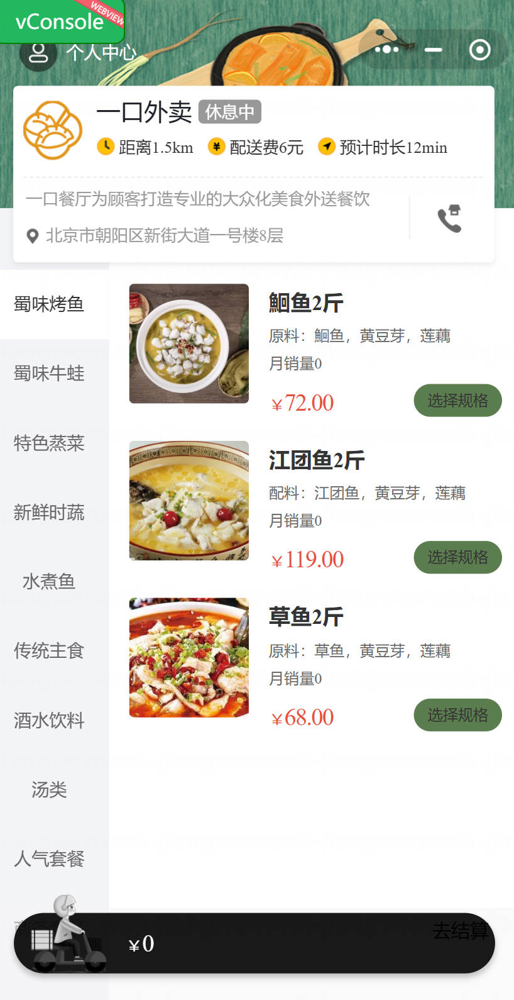

<h1 align="center">基于Spring Boot 的外卖点餐系统系统【带论文】</h1>

- <b>完整代码获取地址：从戎源码网 ([https://armycodes.com/](https://armycodes.com/))</b>
- <b>技术探讨、资料分享，请加QQ群：692619798</b>
- <b>作者微信：19941326836  QQ：3645296857</b>
- <b>承接计算机毕业设计、Java毕业设计、Python毕业设计、深度学习、机器学习</b>
- <b>选题+开题报告+任务书+程序定制+安装调试+论文+答辩ppt 一条龙服务</b>
- <b>所有选题地址 ([https://github.com/Descartes007/allProject](https://github.com/Descartes007/allProject)) </b>

## 一、项目介绍

### 基于 Spring Boot 的外卖点餐系统，分为商家端（后台管理）和用户端（小程序/前端），主要角色为管理员/员工（商家端）与普通用户（C端）。主要功能如下：
### 商家端（管理员/员工）：
- 基本操作：登录、修改密码、获取/修改个人信息
- 店铺管理：设置/获取店铺营业状态
- 工作台：查看营业/订单/菜品/套餐概览统计
- 分类管理：新增、分页查询、修改、删除分类
- 菜品管理：新增（含口味）、分页查询、修改、批量删除、缓存清理
- 套餐管理：新增/修改/删除/分页、套餐菜品关系管理
- 订单管理：后台接单/拒单/取消/派送/订单状态管理
- 报表统计：营业额、销量TOP、用户/订单报表、导出
- 文件上传：图片上传到 Ali OSS
### 员工/用户/日志管理：员工信息、操作日志记录等
- 实时通知：WebSocket 推送来单等实时消息
- 用户端（小程序 / H5 前端）：
- 基本操作：微信登录（openid）、查看/修改个人信息
- 浏览功能：分类列表、菜品/套餐列表与详情
- 购物车：添加、查看、减少单项、清空
- 下单与支付：提交订单、发起微信支付预单（后端支持并可在本地模拟支付回调）
- 订单管理：订单历史查询、订单详情、取消、再来一单
- 地址簿：新增/选择/管理收货地址

## 二、项目技术

- 编程语言：Java（后端）
- 前端（管理后台）：Vue.js（Vue Router）、Vuex、Axios、UI 框架
- 小程序端：微信小程序

## 三、运行环境

- JDK版本：1.8及以上都可以
- 操作系统：Windows7/10、MacOS
- 开发工具：IDEA、Ecplise、MyEclipse都可以

## 四、数据库配置文件

- npm版本：6.14.13及以上都可以
- Redis版本：3.2.100及以上都可以
- 文件名：application.yml和application-dev.yml
- 编码类型：utf8

## 论文截图

## 系统截图

